### Publicação de Imagens EUMETSAT

Desenvolvimento  de um site/sistema para publicação de imagens geradas a partir do satélite METEOSAT (EUMETSAT).

O sistema cataloga automaticamente as imagens, importando-as para um servidor Geoserver.
No caso das imagens NDVI o raster da imagem é totalmente importado para um banco de dados PostgreSQL/PostGIS, dessa forma é possível extrair séries de dados de qualquer ponto da imagem, bastando clicar no ponto desejado.

O sistema possui links para localização rápida de Municípios, Estados e Biomas. O usuário pode ainda subir shapes com áreas de interesse específicas.

É possível na página com o mapa calcular tamanhos de áreas desenhando um polígono sobre essas áreas.

Um cadastro de usuários permite controlar quem tem acesso às imagens, assim como definir quais produtos especificamente o usuário pode acessar.

Também é possível efetuar o download de partes das imagens.
Foram utilizadas as seguintes ferramentas:
- Python
- PostgreSQL/PostGIS
- Geoserver
- GDAL
- NumPy, Pandas e SciPy
- Flask
- Docker ( o sistema roda em containers )

#### Telas do sistema

Imagem do tipo NDVI - o raster dessa imagem está no banco PostgreSQL/PostGIS, dessa forma é fácil de consultar séries históricas (como no rodapé):
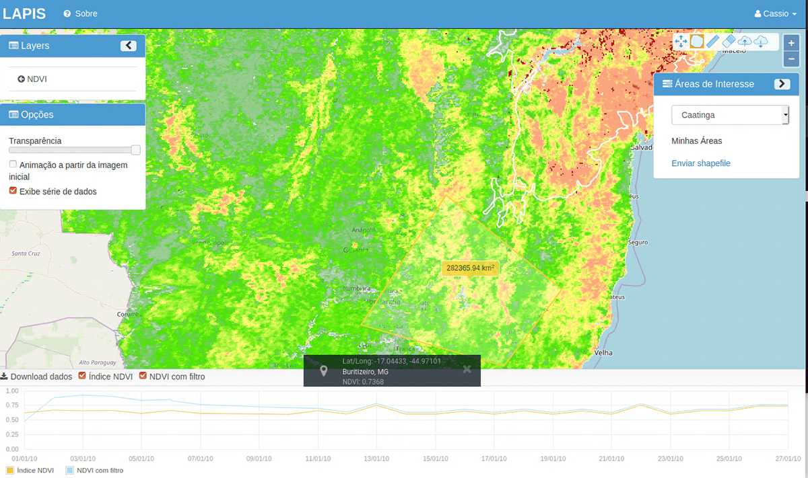

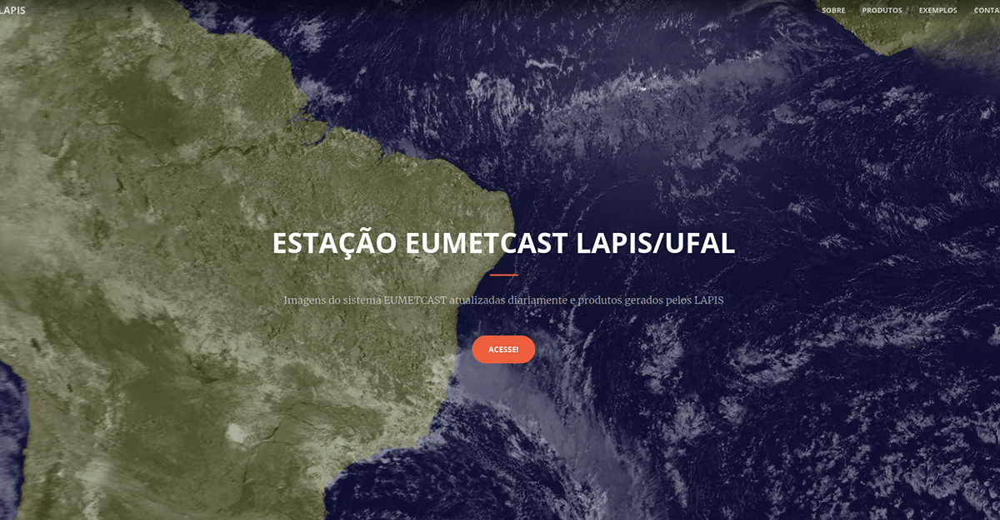

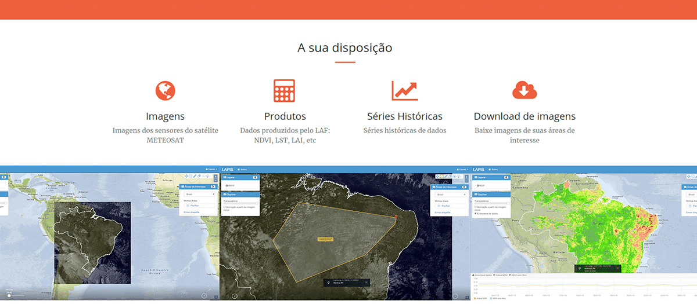

Layers disponíveis no Sistema - novas layers podem ser adicionadas pelo administrador:
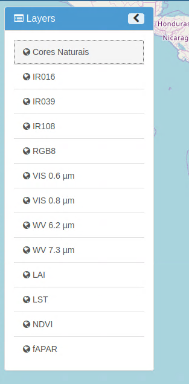

As mesmas layers no Geoserver - o cadastro no Geoserver (Layers e Storage) é feito automaticamente pelo sistema, assim como o upload das futuras imagens:
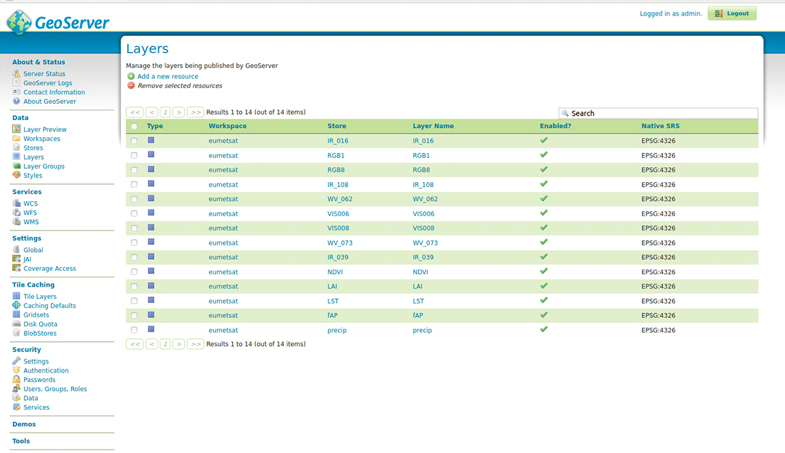

Visualização de imagem do tipo Cores Naturais:
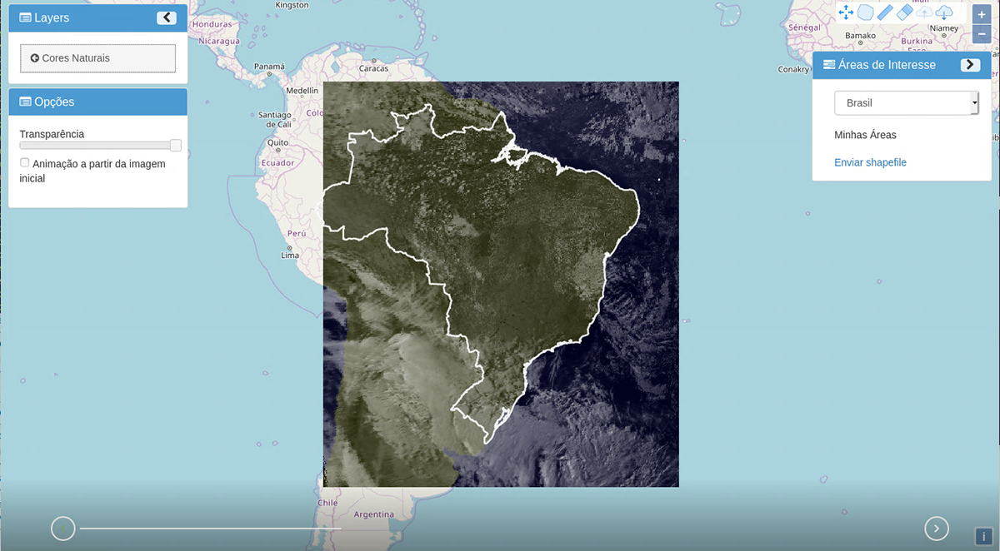

Visualização de imagem do tipo LAI:
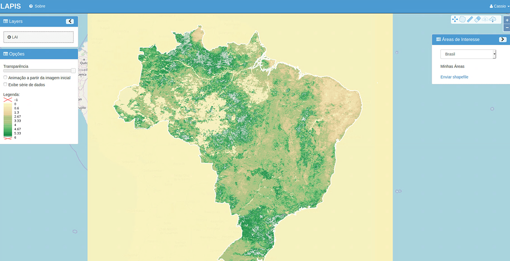

Seleção de Área de Interesse:
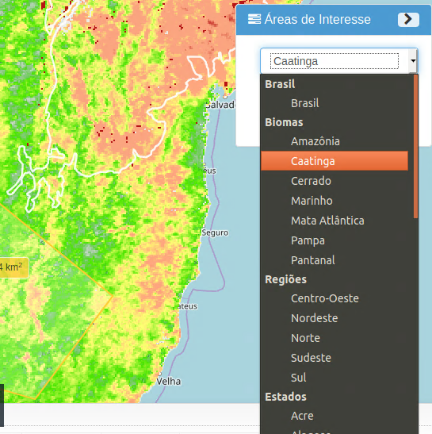

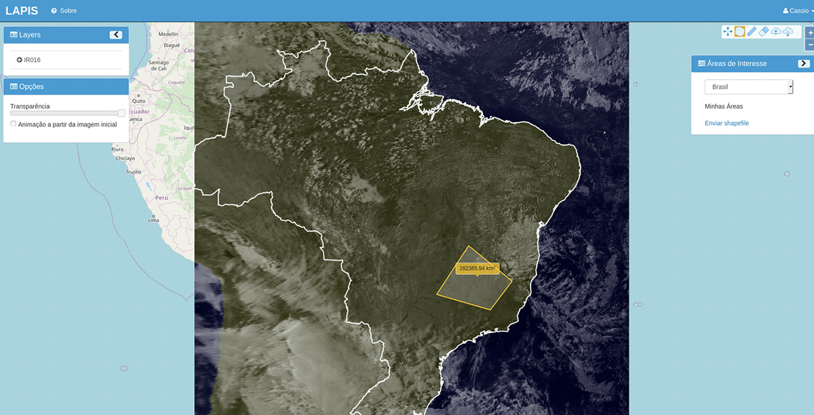

Detalhe da visualização da série histórica do NDVI - O filtro mencionado é o Wiener:
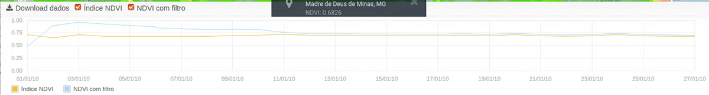

É possível efetuar o download da série histórica em formato CSV
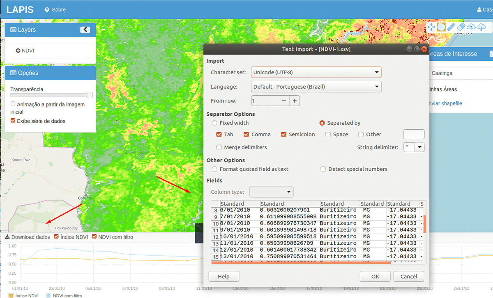