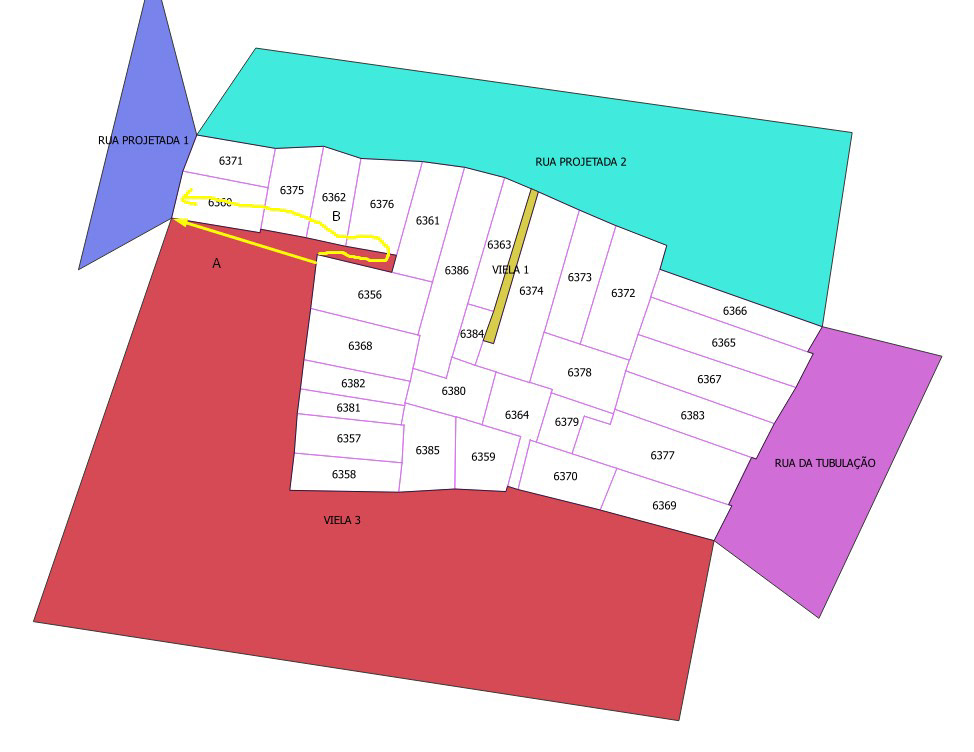
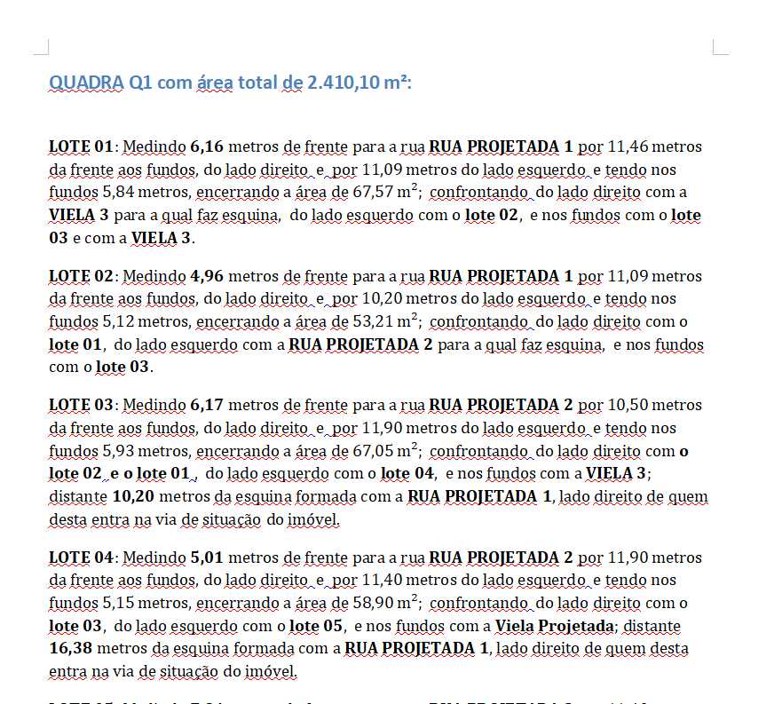

### Descrição Fundiária (Memorial Descritivo)

Sistema desenvolvido para criar descrições automáticas de um loteamento a partir de uma planta baixa com apenas o desenho dos lotes e das ruas.
Tecnologia utilizada: Python, GDAL e PostgreSQL

