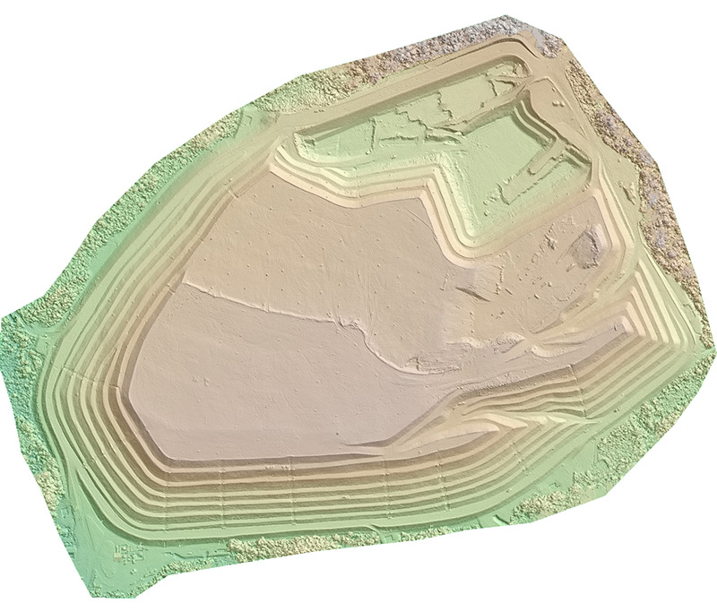

### Processamento de Imagens de Drones / Geração de Tiles

Desenvolvimento de sistema para pós-processamento de imagens produzidas por drones. O processamento inicial é feito com Pix4d (versão servidor) e posteriormente, com uso de GDAL, reprojetado, convertido em DEM e gerados os tiles com Mapnik para publicação na WEB, com nível de zoom de 0 a 19.
Todo processamento é automatizado, usando as seguintes ferramentas da Amazon:
-Amazon S3
-Amazon SQS (Queue)
-Amazon EC2 (máquinas on-demand)
-Amazon SWG (Amazon Simple Workflow Service

