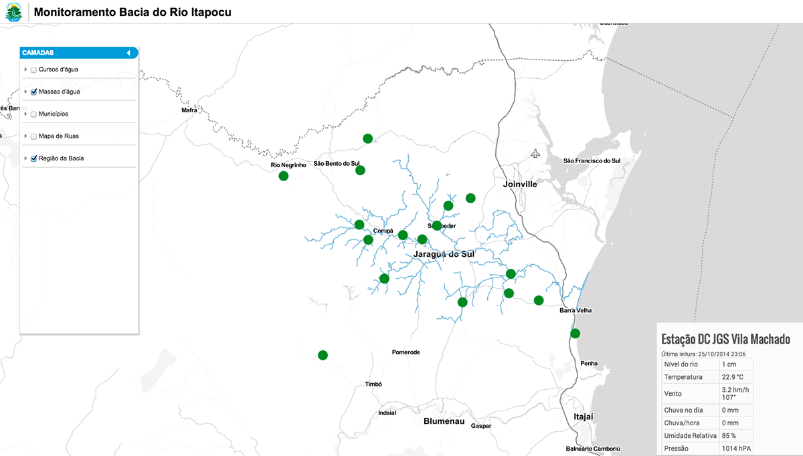
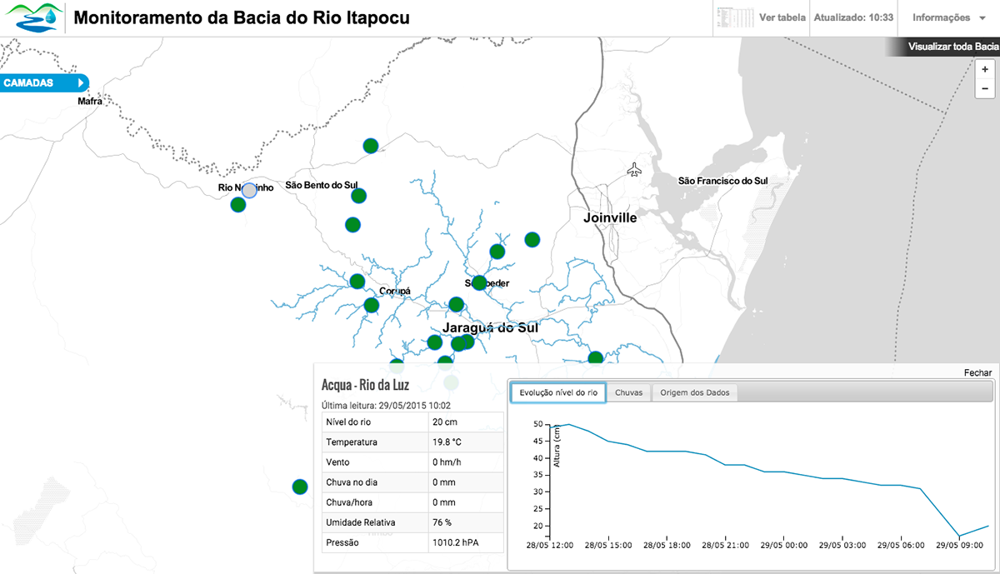
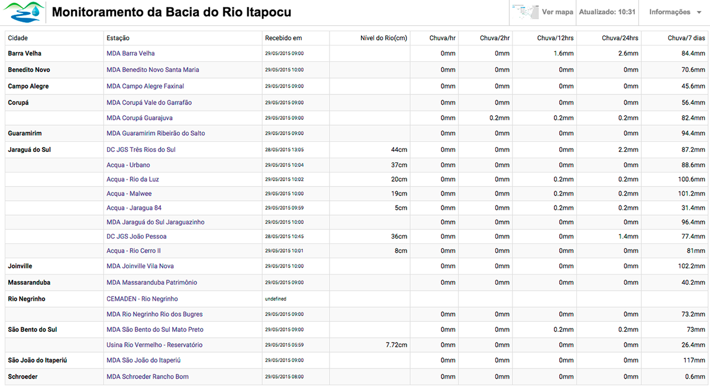

### Sistema de Monitoramento da Bacia do Itapocu

Sistema criado com a finalidade de integrar dados das diversas redes de monitoramento existentes na Bacia do Rio Itapocu. Foram integradas redes da EPAGRI/CIRAM, CEMADEN, Defesa Civil e Malwee.

Tecnologias usadas: Python, PostgreSQL, Flask

