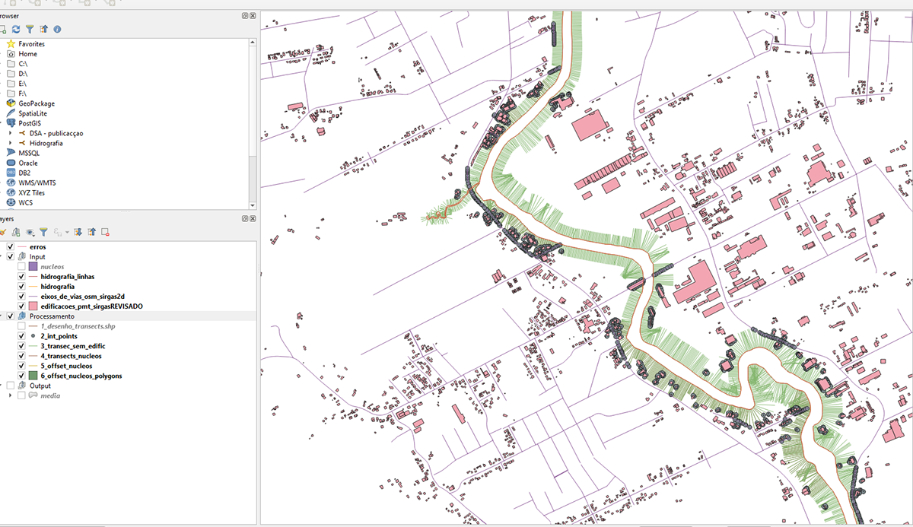
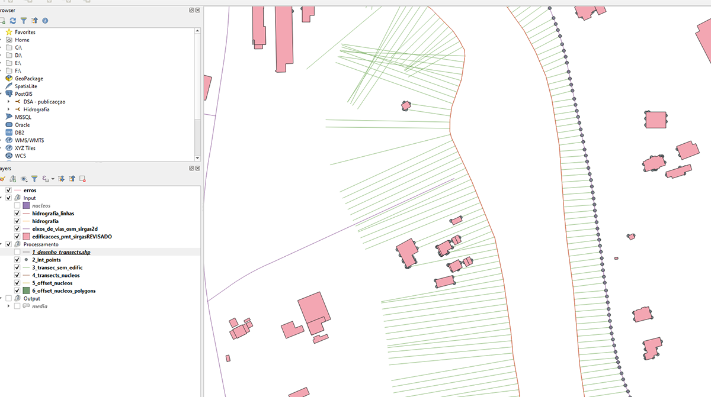
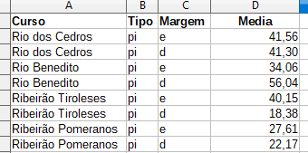

### Estudo para regularização ambiental do Vale do Itajaí

Esse estudo desenvolvido para a Associação dos Municípios do Médio Vale do Itajaí (AMMVI) teve como objetivo determinar a ocupação em áreas de urbanas com vistas à regularização perante o novo Código Florestal.
Minha participação no projeto foi a de criar uma rotina que determinasse a ocupação média a partir dos shapefiles com as edificações, vias e hidrografia. Para isso, criei uma rotina em Python que gerava transectos a partir do eixo do rio e esses transectos foram "cortados" pelas edificações e vias urbanas. Ao final, era gerado um relatório com a média de ocupação baseado no comprimento dos transectos.

Ferramentas utilizadas:
- Python
- NumPy
- Shapely   

