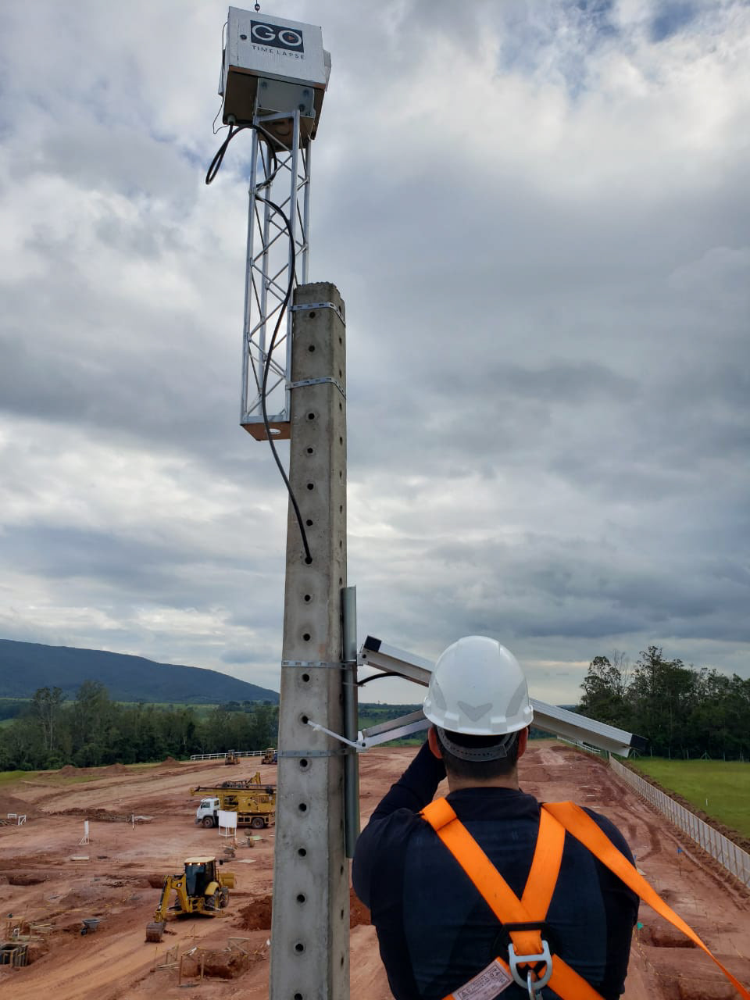
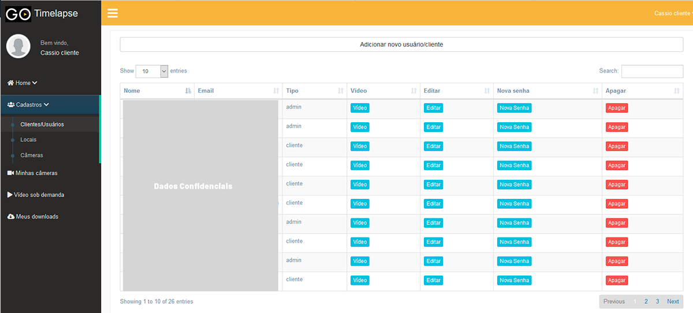
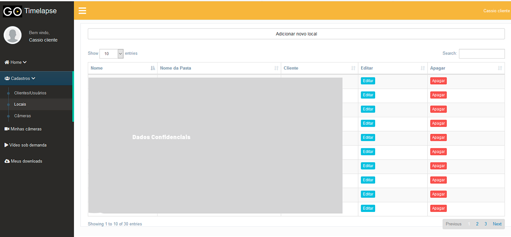
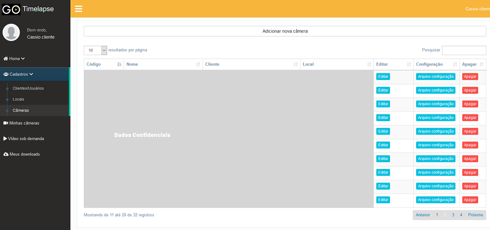
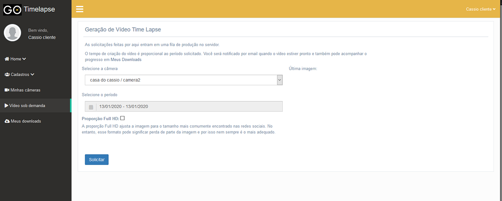
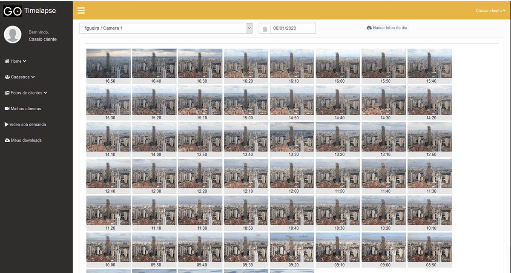
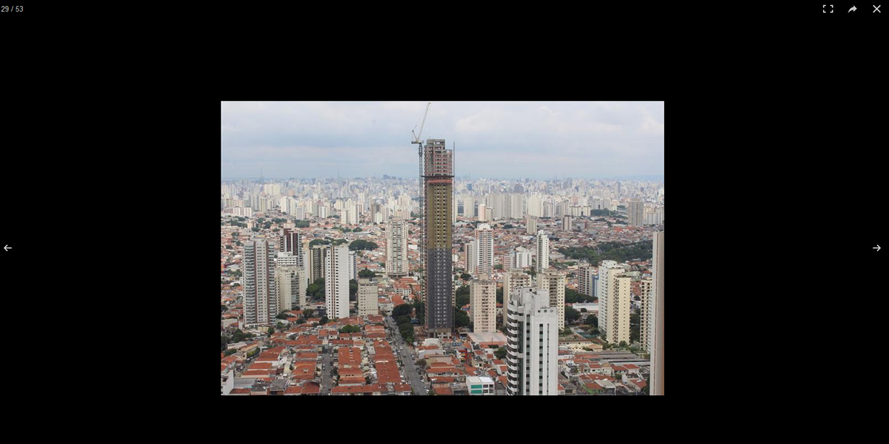

### Sistema para timelapse de obras.

O sistema é composto de duas partes: servidor e câmera(s).

Cada caixa instalada em um cliente possui uma câmera DSLR, uma Raspberry e um modem 4G. Na frequência, hora e dias determinados pelo administrador do sistema, é tirada uma foto e esta é enviada por rede 4G para o servidor.
As câmeras podem ser configuradas remotamente através do site do administrador. A informação é enviada automaticamente pela rede 4G.

O usuário final pode efetuar o download das imagens ou solicitar para que o sistema crie automaticamente um vídeo no período desejado.

Ferramentas utilizadas:

Python (tanto no servidor quanto nas estações remotas)
Flask
Amazon EC2 e S3

Exemplo de vídeo gerado:

